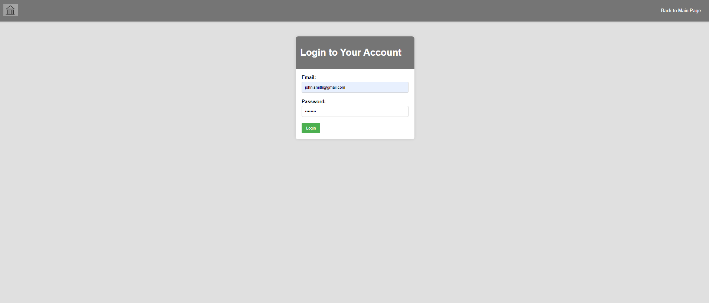
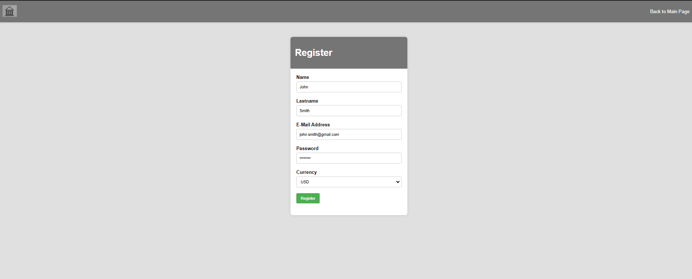
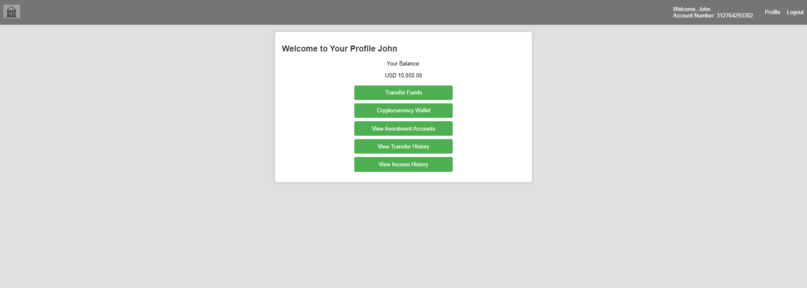
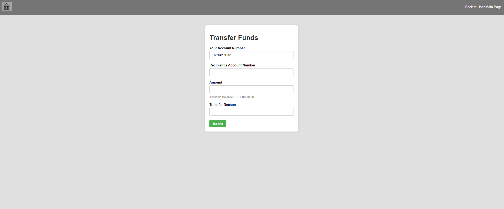
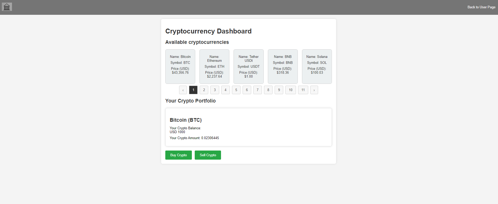
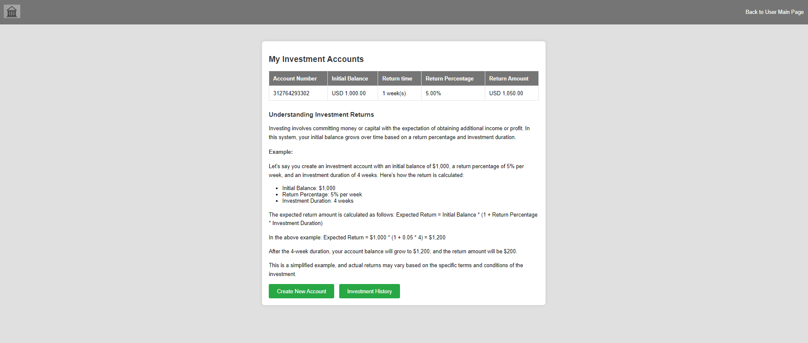

# Mini Internet Bank

Mini Internet Bank is a web application developed using PHP with the Laravel framework, backed by MySql. The front-end is powered by jQuery, providing a user-friendly interface for banking operations. This project includes features for account management, cryptocurrency activities, fund transactions, and a dashboard for monitoring financial activities.

## Features 

### Login Page

### Register Page

### User Dashboard

### Transactions

### Crypto Dashboard

### Investment Dashboard

## Requirements
* Git
* Code Editor (e.g., PHPStorm or any other)
* MySql (or any compatible database for data storage)
* PHP
* PHP Extensions for Laravel
